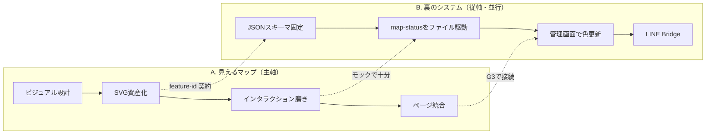

# リフトマップ先行ロードマップ（ビジュアル優先）

**方針**: 来場者・関係者に「リフトマップとして見せられる」状態を最優先で到達する。LINE・DB・ハブ連携などのシステムは **裏で並行** し、見た目の完成をブロックしない。

**見た目の正（2026-06 更新）**: Mapbox 衛星 3D は品質目標とずれる。**標高 DEM → イラスト生成パイプライン** を本筋とする → [ELEVATION_ILLUSTRATION_MODEL.md](./ELEVATION_ILLUSTRATION_MODEL.md)

**関連**: [LIFT_MAP_WEBDX_TEMPLATE.md](./LIFT_MAP_WEBDX_TEMPLATE.md)（技術設計） / [laax_gap_spec.md](./laax_gap_spec.md)（LAAX ベンチマーク・G2–G4 受け入れ） / [sichinohe-CyoueiSki/agents/MASTER_SUMMARY_AND_ROADMAP.md](../sichinohe-CyoueiSki/agents/MASTER_SUMMARY_AND_ROADMAP.md)（サイト全体）

---

## 0. ゴール定義（「見られる」とは）

| レベル | 名称 | 完了条件（関係者デモ可） |
|--------|------|--------------------------|
| **G0** | 技術デモ | `/map` でパン・ズーム・タップ・凡例・モック色変化 |
| **G1** | ビジュアルMVP | **七戸のイラスト／公式マップ風**の SVG が画面の主役。リフト・主要コースがタップ可能（**現状ここ**） |
| **G2** | プロダクトMVP | G1 + `/courses` 先頭にマップ埋め込み + 「最終更新」+ 停止理由が読める |
| **G3** | 運用っぽい見え方 | G2 + 管理画面 or JSON 1ファイルの手動更新で色が変わる（LINE不要） |
| **G4** | リアルタイム | G3 + 現場更新が数十秒以内に反映（API本番・将来LINE） |

**このロードマップの主戦場**: **G0 → G2 を最速**（目安 **2〜3週間**、並行1人＋デザイン支援なら **1〜1.5週間**）。G3以降は裏トラックで追いつかせる。

---

## 1. 現状スナップショット（2026-06）

| 項目 | 状態 |
|------|------|
| `/[locale]/map` | デモ用幾何 SVG + `LiftMapViewer`（パン・ズーム・ボトムシート） |
| `/api/public/map-status` | モック JSON（色の動的変更の配線済み） |
| `/api/public/map` | 中心座標 + OSM 由来 `lifts.geojson`（**1本のみ**） |
| `/courses` | マップは説明テキストのみ、**ビューア未埋め込み** |
| 公式イラスト | skimap.org 2012 版を参考（[sources.md](../sichinohe-CyoueiSki/web/data/map/sources.md)） |
| 未整備 | ポニーリフト線、コース `runs.geojson`、イラスト SVG の本番化 |

---

## 2. 二軌道の進め方

**ルール**

- A が止まる作業（DB設計会議、LINE審査など）は **スプリントの待ち行列に入れない**。
- B は **常にモック JSON** で進め、A の UI が完成してから接続する。
- 新規ゲレンデ汎用化は **G2達成後**（テナント設定・SVG差し替え手順の文書化）。

---

## 3. マイルストーン（A軸：ビジュアル）

### M1 — ビジュアル設計の確定（2〜3日）

**成果物**

- Figma: 375px フレーム1枚（マップ全画面）+ BottomSheet + 凡例
- 色・タイポ・FAB 位置のトークン一覧（[LIFT_MAP_WEBDX_TEMPLATE.md §2](./LIFT_MAP_WEBDX_TEMPLATE.md) と一致）
- **マップ表現の方針決定**（七戸は以下いずれかを1つ選ぶ）

| 選択肢 | 向き | 工数 |
|--------|------|------|
| **A. イラスト SVG**（推奨・フェーズ1） | LAAXに近い「ゲレンデらしさ」。紙マップ／skimap をトレース | 中（デザイナー必須） |
| B. OSM 線のみ | 正確だが貧弱な見た目。MVPの仮置き向き | 小 |
| C. イラスト底 + OSM オーバーレイ | 将来の GPS／3D への橋。G1では A のみでも可 | 大 |

**M1 決定（2026-06-07）**: **A（イラスト SVG）** で確定。C は G3/G4 まで見送り。

**完了条件**: 関係者が Figma プロトで「これがリフトマップ」と言える。

**ブロッカー回避**: 公式の最新イラストが無い場合 → skimap 2012 + 現場ヒアリングで **β版** とラベル表示。

---

### M2 — SVG 資産化と feature-id 付与（3〜5日）

**作業**

1. Illustrator / Figma から SVG エクスポート → `web/public/maps/sichinohe-illustration.svg`（または分割レイヤ）
2. リフト・コース path ごとに `id` + `data-feature-id`（`lift-1`, `trail-a` …）を付与
3. `map-features.json`（名称・種別・メタのマスタ）を `web/data/map/` に置く
4. `DemoResortSvg` を **本番 SVG ローダ**（`ResortMapSvg`）に差し替え

**完了条件（G1）**

- スマホ実機でピンチ・パンが快適
- 全リフト（公式で言及される本数）がタップで名前が出る
- 停止時はグレー＋必要ならハッチング

**参照データ**

- 既存: `web/data/map/lifts.geojson`（OSM 1本）→ **イラスト上の座標合わせの参考**に留める
- 追加: `web/data/map/features.manifest.json`（id ↔ 表示名 ↔ 種別）

---

### M3 — インタラクション・UI 磨き（2〜4日）

**作業**

| 項目 | 内容 |
|------|------|
| ヘッダー | 施設名・最終更新・オフライン帯 |
| 凡例 | シート or 折りたたみ（稼働／停止／確認中） |
| コントロール | ＋／−／全体表示（実装済みを本番 SVG に接続） |
| ボトムシート | 理由・所要・公式リンク（任意） |
| アクセシビリティ | フォーカス・`aria-label` に状態文言 |
| パフォーマンス | SVG 軽量化（パス結合・不要メタ削除） |

**完了条件**: チーム内で「LAAX の簡易版」と言って恥ずかしくないスマホ体験。

**任意（時間があれば）**: ピンチ慣性、ミニマップ、フィルタチップ。

---

### M4 — サイトへの統合（1〜2日）

**作業**

1. `/[locale]/courses` 先頭に `<LiftMapViewer />` を **ヒーロー高さ**で埋め込み
2. トップ or `/today` から「マップを見る」CTA
3. OGP 用マップスクショ（静的 PNG 1枚）— SNS プレビュー用

**完了条件（G2）**: ステージング URL を共有し、**コースページを開けばマップが主役**。

---

### M5 — 見せ方・信頼の仕上げ（1日）

- 「β版マップ」「要公式確認」バッジ
- 出典（OSM / イラスト改変）フッター — [sources.md](../sichinohe-CyoueiSki/web/data/map/sources.md) 準拠
- Lighthouse モバイル パフォーマンス簡易確認

---

## 4. マイルストーン（B軸：裏のシステム・並行）

| ID | 内容 | A軸への依存 | 目安 |
|----|------|-------------|------|
| B1 | `map-status` スキーマを `features.manifest` と ID 統一 | M2 開始時 | 0.5日 |
| B2 | `web/data/map/status.json` を API が返す（手編集可） | M2 完了後 | 0.5日 |
| B3 | 既存 `/admin` にリフト状態トグル（最小） | M4 前後 | 1〜2日 |
| B4 | `resort-data.json` の lift サマリーと map-status 同期 | B3 | 1日 |
| B5 | LINE Webhook スタブ（ログのみ） | G3 後 | 2日〜 |
| B6 | PostgreSQL + 監査ログ | G4 | 別スプリント |

**G3 達成**: B2 または B3 で、デモ時に **1クリックで色が変わる**。

**意図的に後回し**: japowserch 連携、SSE、Mapbox 3D、多言語マップコピー全文。

---

## 5. スプリント案（2週間×2）

### スプリント 1（週1〜2）— G1 狙い

| 曜日目安 | A軸 | B軸 |
|----------|-----|-----|
| 月〜火 | M1 Figma + イラスト方針決定 | B1 スキーマ・manifest |
| 水〜金 | M2 SVG トレース・feature-id | B2 status.json + API 差し替え |
| 金 | M2 実機確認 | — |

**スプリント1レビュー**: `/map` に本番 SVG が載っている。

### スプリント 2（週3〜4）— G2〜G3 狙い

| 曜日目安 | A軸 | B軸 |
|----------|-----|-----|
| 月〜水 | M3 UI 磨き | B3 admin トグル |
| 木〜金 | M4 `/courses` 統合 | B4 サマリー同期 |
| 金 | M5 免責・OGP | ステークホルダーデモ |

**スプリント2レビュー**: コースページ＝リフトマップ体験、必要なら管理画面で色変更デモ。

---

## 6. 役割分担（少人数向け）

| 役割 | 主担当 |
|------|--------|
| イラスト SVG・Figma | デザイナー（外注可） |
| `ResortMapSvg`・パンズーム | フロントエンジニア |
| feature manifest・API 接続 | フロント or フルスタック |
| 公式ファクトチェック（リフト本数・名称） | 現場／営業 |
| LINE・DB | G2 達成まで **未割当** |

---

## 7. リスクと切り戻し

| リスク | 対策 |
|--------|------|
| 公式イラストが使えない | skimap ベース β + 早めに運営確認依頼 |
| SVG が重い | レイヤ分割・画面外は簡略 path |
| リフト本数が資料と不一致 | manifest を「要確認」ステータスで公開 |
| 並行で API を作りすぎる | B は **JSON ファイル1枚** までに抑える |

---

## 8. チェックリスト（コピー用）

### G1

- [ ] Figma 1フレーム承認（任意・後追い可）
- [x] `public/maps/sichinohe-illustration.svg` に本番 SVG
- [x] 全リフト（ペア・ポニー）+ コース4本に透明ヒットボックス（`lift-markers.json`）
- [x] `/map` でタップ・凡例・ズーム・β表示
- [ ] 公式レイアウトとの位置合わせ精査（現場確認後）

### G2

- [x] `/courses` にマップヒーロー
- [ ] トップ or today から導線
- [ ] 最終更新時刻表示
- [ ] β/免責表示

### G3（裏）

- [ ] `status.json` または admin で色変更
- [ ] 変更が `/map` に反映

---

## 9. 次のアクション（今日から）

1. ~~**M1**: マップ表現を **A（イラスト SVG）** で進めるか確認~~ → **A 確定**
2. **素材収集**: skimap 1345・現場の紙マップ写真・リフト名称リストを1枚にまとめる
3. **M2 着手**: イラスト SVG トレース + `features.manifest.json` ドラフト
4. ~~**map-interaction-spec**: G2 状態追記~~ → [`map-interaction-spec-g2.md`](../sichinohe-CyoueiSki/docs/map-interaction-spec-g2.md)
5. **触らない**: LINE Developers 申請、DB マイグレーション、Mapbox 契約

---

*ビジュアルが G2 に達した時点で、全国テンプレの「導入手順（SVG差し替え＋manifest）」を `docs/` に追記する。*
