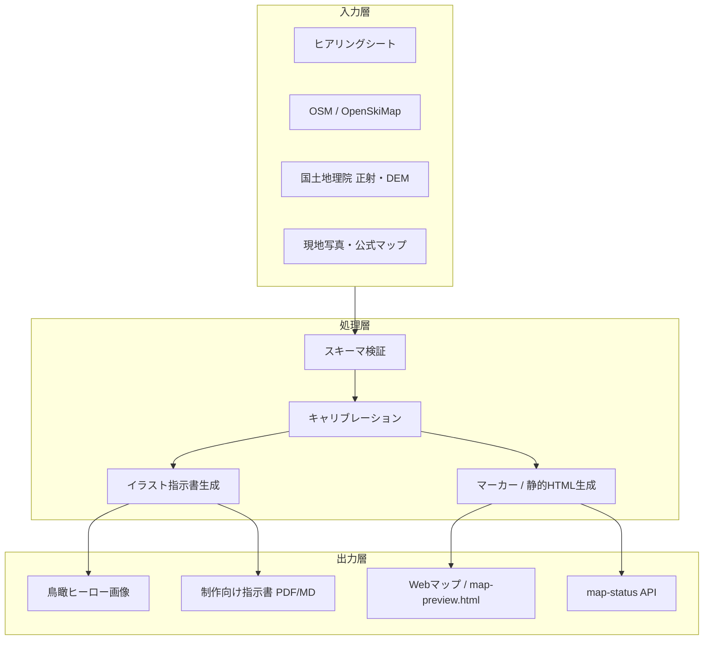

# 汎用ゲレンデマップ作成システム — 要件定義書

**版**: v0.1（2026-06-05）  
**対象**: 見ず知らずのスキー場でも、現場に忠実な鳥瞰イラストマップを再現可能にするマルチテナント基盤  
**パイロット実績**: 七戸町営スキー場（`sichinohe-CyoueiSki`）

---

## 0. 議論ログ（Chain of Thought）

### ステップ1 — 【マップ職人】必須データ項目

> 「正確で美しい鳥瞰図は、**地理の正**と**見た目の正**を分けて持ち、後で結合する。根拠のない線を描くな。」

#### A. リゾート識別・基本属性（必須）

| 変数ID | 項目 | 形式 | 用途 |
|--------|------|------|------|
| `resort.id` | スラッグ（一意） | string | テナント分離 |
| `resort.name` | 公式名称 | string | 表示・プロンプト |
| `resort.name_en` | 英語名 | string | 多言語 |
| `resort.address` | 住所 | string | 座標照合 |
| `resort.center` | 中心座標 | `{lng, lat}` | bbox 初期値 |
| `resort.elevation` | 標高（ベース/山頂） | `{base_m, top_m}` | 影・スケール感 |
| `resort.season` | 営業期間 | date range | 冬景プロンプト |
| `resort.contact` | 担当者 | name, email, tel | 現地確認 |

#### B. 地理・地形（必須 — イラストの骨格）

| 変数ID | 項目 | 形式 | 取得元候補 |
|--------|------|------|------------|
| `geo.bbox` | 対象範囲 | west/east/south/north | GSI / 手動 |
| `geo.dem` | 標高モデル | GeoTIFF or tile ref | 国土地理院 DEM5A |
| `geo.gsi_ortho` | 正射写真 | PNG + bbox | 国土地理院シームレス |
| `geo.aspect` | 主斜面方位 | degrees | 現地・DEM 解析 |
| `geo.tree_line` | 林帯・開墾境界 | polygon | 正射・現地 |

**マップ職人の断言**: bbox なしでイラストを描くのは禁止。正射 or DEM はどちらか必須。

#### C. リフト（必須 — 1本でも）

| 変数ID | 項目 | 形式 | 必須度 |
|--------|------|------|--------|
| `lift[].id` | 一意ID | string | 必須 |
| `lift[].name` | 表示名 | string | 必須 |
| `lift[].type` | pair / surface / gondola 等 | enum | 必須 |
| `lift[].geometry` | 走行線 | LineString `[lng,lat][]` | 必須 |
| `lift[].stations` | 上下駅 | Point + 名称 | 必須 |
| `lift[].source` | 根拠 | OSM way ID / 現地測量 / 公式図 | **必須** |
| `lift[].length_m` | 全長 | number | 推奨 |
| `lift[].vertical_m` | 標高差 | number | 推奨 |
| `lift[].ride_time_min` | 所要時間 | number | 任意 |

#### D. コース（必須 — 公開本数分）

| 変数ID | 項目 | 形式 | 必須度 |
|--------|------|------|--------|
| `trail[].id` | 一意ID | string | 必須 |
| `trail[].name` | コース名 | string | 必須 |
| `trail[].difficulty` | beginner〜expert | enum | 必須 |
| `trail[].geometry` | 中心線 or 幅付き | LineString / Polygon | 必須 |
| `trail[].source` | 根拠 | skimap / OSM piste / 公式 / 現地 | **必須** |
| `trail[].max_slope_deg` | 最大斜度 | number | 推奨 |
| `trail[].length_m` | 滑走距離 | number | 推奨 |
| `trail[].snow_type` | 圧雪/非圧雪 | enum | 推奨 |

#### E. 施設・ランドマーク（推奨 — イラストの読みやすさ）

| 変数ID | 項目 |
|--------|------|
| `poi[].type` | lodge / parking / rest / patrol / floodlight |
| `poi[].name` | 名称 |
| `poi[].geometry` | Point or Polygon |
| `poi[].visible_on_map` | イラストに描くか |

#### F. カメラ・画風（必須 — 鳥瞰の統一）

| 変数ID | 項目 | 例 |
|--------|------|-----|
| `camera.heading_deg` | 視線方位（北=0） | 280〜320（西寄り） |
| `camera.tilt_deg` | 傾き（0=真下, 90=水平） | 70〜85 |
| `camera.style` | 画風プリセット | `winter_illustration` / `gsi_overlay` / `photo_hero` |
| `camera.reference_image` | 参考マップ | skimap URL、公式PDF |
| `camera.season` | 表現季節 | winter_day / night |

#### G. キャリブレーション（必須 — イラストと地理の結合）

| 変数ID | 項目 | 説明 |
|--------|------|------|
| `calibration.control_points[]` | 地面コントロール点 | `{id, lng, lat, role}` |
| `calibration.hero_anchors[]` | イラスト上の対応ピクセル | `{control_point_id, px, py}` |
| `calibration.method` | 投影方式 | `gsi_bbox` / `affine_4pt` / `camera_model` |
| `calibration.qa_signed_by` | 現地確認者 | 名前・日付 |
| `calibration.max_error_px` | 許容誤差 | 既定 20px |

#### H. 法務・帰属（必須）

| 変数ID | 項目 |
|--------|------|
| `legal.gsi_attribution` | © 国土地理院 |
| `legal.osm_attribution` | © OpenStreetMap |
| `legal.disclaimer` | β版/現場確認前の免責 |
| `legal.client_approval` | 運営元承認フラグ |

---

### ステップ2 — 【システムエンジニア】データ管理・DB構造

> 「全ゲレンデを **同じ JSON Schema** で扱う。ソース追跡と品質ゲートを DB 制約に落とす。」

#### 2.1 設計原則

1. **テナント分離**: `resort_id` で全テーブル／ファイルをスコープ
2. **出典必須**: 幾何データは `source_type` + `source_ref` なしでは `status != published` にできない
3. **版管理**: イラスト・GeoJSON・キャリブレーションは `version` + `published_at` を持つ
4. **生成物分離**: 入力データ（raw）と生成物（hero PNG, prompt, markers）を別エンティティに
5. **オフライン配布**: 静的 `map-preview.html` をビルドパイプラインの出力に含める

#### 2.2 論理データモデル（ER 概要）

```
Resort 1──* LiftLine
Resort 1──* TrailLine
Resort 1──* PointOfInterest
Resort 1──* ControlPoint
Resort 1──* MapAsset（hero, gsi, skimap_ref）
Resort 1──* CalibrationRun
Resort 1──* IllustrationBrief（AIプロンプト指示書）
Resort 1──* MapStatus（運行状況、別ドメイン）
```

#### 2.3 コアテーブル定義

##### `resorts`

| カラム | 型 | 備考 |
|--------|-----|------|
| id | UUID / slug | PK |
| name_ja | text | |
| name_en | text | nullable |
| center_lng, center_lat | double | |
| elevation_base_m, elevation_top_m | int | |
| bbox_west, bbox_east, bbox_south, bbox_north | double | |
| status | enum | draft / calibrating / published |
| created_at, updated_at | timestamptz | |

##### `geo_features`（リフト・コース共通）

| カラム | 型 | 備考 |
|--------|-----|------|
| id | UUID | PK |
| resort_id | FK | |
| feature_type | enum | lift / trail |
| feature_key | string | `lift-pair` 等、API 契約ID |
| name | text | |
| geometry | geography(LineString) | PostGIS |
| properties | jsonb | difficulty, lift_kind, meta |
| source_type | enum | osm / gsi / skimap / field_survey / official_map |
| source_ref | text | way/631879096 等 |
| verification_status | enum | unverified / qa_passed / field_approved |
| version | int | |

##### `control_points`

| カラム | 型 | 備考 |
|--------|-----|------|
| id | UUID | PK |
| resort_id | FK | |
| point_key | string | lift-pair-bottom |
| lng, lat | double | |
| role | text | 人間可読ラベル |
| linked_feature_id | FK nullable | geo_features |

##### `hero_anchors`

| カラム | 型 | 備考 |
|--------|-----|------|
| id | UUID | PK |
| control_point_id | FK | |
| map_asset_id | FK | どのイラスト上か |
| px, py | double | 画像座標 |
| captured_by | enum | manual_click / imported |

##### `map_assets`

| カラム | 型 | 備考 |
|--------|-----|------|
| id | UUID | PK |
| resort_id | FK | |
| asset_type | enum | hero_illustration / gsi_ortho / skimap_ref / earth_studio |
| file_path | text | |
| width, height | int | |
| projection | text | gsi_bbox / camera_model |
| bbox_* | double | nullable |
| version | int | |
| is_published | bool | |

##### `calibration_runs`

| カラム | 型 | 備考 |
|--------|-----|------|
| id | UUID | PK |
| resort_id | FK | |
| method | text | |
| input_snapshot | jsonb | 実行時の control_points + geo |
| output_snapshot | jsonb | lift-markers.json 等 |
| max_residual_px | double | |
| passed | bool | |
| run_at | timestamptz | |

##### `illustration_briefs`（AI 自動生成の出力）

| カラム | 型 | 備考 |
|--------|-----|------|
| id | UUID | PK |
| resort_id | FK | |
| prompt_positive | text | 地形・建物・雪面 |
| prompt_negative | text | 除外要素 |
| camera_spec | jsonb | heading, tilt, style |
| reference_urls | text[] | |
| generated_at | timestamptz | |
| model | text | 使用モデル |

#### 2.4 ファイルベース MVP（現行パイロット互換）

DB 前段階として、ゲレンデごとに以下を保持（`sichinohe-CyoueiSki/web/data/map/` と同型）:

```
data/map/
  features.manifest.json   # リゾートメタ + feature-id マスタ
  hero-meta.json           # GSI bbox
  lifts.geojson
  trails.geojson
  control-points-hero.json
  lift-markers.json        # 生成物
  status.json              # 運行（別系統）
public/maps/
  {resort}-hero.png
  {resort}-hero-gsi.png
  map-preview.html         # 静的オフライン
```

#### 2.5 パイプライン（自動化ステージ）

```
[ヒアリング入力]
    → validate-schema
    → fetch-osm-lifts / fetch-gsi-ortho
    → fetch-pony-lift（OSMなければ GSI+skimap 照合）
    → align-hero-gsi（マーカー生成）
    → build-map-preview（静的HTML）
    → illustration-brief-generator（プロンプト出力）
    → QA gate（±20px, source 監査）
    → publish
```

#### 2.6 品質ゲート（システム制約）

| ゲート | 条件 | 失敗時 |
|--------|------|--------|
| G1 出典 | 全 geometry に source_ref | publish ブロック |
| G2 キャリブ | 端点残差 ≤ 20px | `verification_status` 据え置き |
| G3 現地 | `qa_signed_by` あり | disclaimer 自動付与 |
| G4 表示 | 手置き PIXEL 直書きなし | CI 失敗 |

---

### ステップ3 — 【進行役】統合：システム全体像

#### 3.1 システム目的

**任意のスキー場**について、クライアントヒアリング → 地理データ整備 → 鳥瞰イラスト生成指示 → Web マップ公開までを、**同じワークフロー**で再現する。

#### 3.2 アーキテクチャ（3層）



#### 3.3 マルチエージェント役割（運用時）

| エージェント | 責務 |
|--------------|------|
| 進行役 | ヒアリング完了判定、ゲート承認、納品物統合 |
| マップ職人 | 画風・カメラ・コントロール点の妥当性レビュー |
| システムエンジニア | パイプライン実行、スキーマ、静的HTML生成 |
| QA監査 | source 監査、残差計測、手置き検出 |

#### 3.4 非機能要件

| 項目 | 目標 |
|------|------|
| 新規ゲレンデオンボード | ヒアリング完了後 **5営業日** で静的プレビュー |
| オフライン確認 | `map-preview.html` をメール添付可 |
| テナント数 | 100+ リゾート（ファイル or DB） |
| ライセンス表示 | GSI/OSM 自動挿入 |

---

## 1. ヒアリングシート（入力フォーム）項目一覧

### セクション A — 基本情報（必須）

| # | 項目名 | 入力形式 | 必須 | 備考 |
|---|--------|----------|------|------|
| A1 | スキー場名（日本語） | text | ○ | |
| A2 | スキー場名（英語） | text | △ | 外国人向けサイトがある場合 |
| A3 | 住所 | text | ○ | |
| A4 | 中心座標（わかれば） | lat/lng | △ | 不明なら住所から geocode |
| A5 | ベース標高（m） | number | ○ | |
| A6 | 山頂標高（m） | number | ○ | |
| A7 | 担当者名 | text | ○ | 現地確認窓口 |
| A8 | 連絡先（メール/電話） | text | ○ | |
| A9 | 公式サイト URL | url | △ | |

### セクション B — リフト（本数分繰り返し・必須）

| # | 項目名 | 入力形式 | 必須 |
|---|--------|----------|------|
| B1 | リフト名 | text | ○ |
| B2 | 種別 | select: ペア/シングル/ポニー/ゴンドラ/その他 | ○ |
| B3 | 下駅の位置（地図でピン or 住所説明） | map pin / text | ○ |
| B4 | 上駅の位置 | map pin / text | ○ |
| B5 | 全長（m） | number | △ |
| B6 | 所要時間（分） | number | △ |
| B7 | 既存の公式マップ・パンフレット | file upload | 推奨 |

### セクション C — コース（本数分繰り返し・必須）

| # | 項目名 | 入力形式 | 必須 |
|---|--------|----------|------|
| C1 | コース名 | text | ○ |
| C2 | 難易度 | select: 初級/中級/上級/最上級 | ○ |
| C3 | コースの走行ライン（地図上トレース or 説明） | map trace / text | ○ |
| C4 | 最大斜度（度） | number | △ |
| C5 | 滑走距離（m） | number | △ |
| C6 | 圧雪/非圧雪 | select | △ |

### セクション D — 施設・ランドマーク（任意）

| # | 項目名 | 入力形式 |
|---|--------|----------|
| D1 | センターハウス位置 | map pin |
| D2 | 駐車場範囲 | polygon / 説明 |
| D3 | キッズエリア | map pin |
| D4 | ナイター照明範囲 | text |

### セクション E — マップ表現（必須）

| # | 項目名 | 入力形式 | 必須 |
|---|--------|----------|------|
| E1 | 参考にしたい既存マップ | file / URL | 推奨 |
| E2 | 見下ろし方向（例: ベースから山頂を見上げる） | text / compass | ○ |
| E3 | 希望画風 | select: 写実冬景 / イラスト / 正射+オーバーレイ | ○ |
| E4 | 雪の表現 | select: 新雪 / 整地 / 春雪 | △ |
| E5 | ナイターを載せるか | yes/no | △ |

### セクション F — データ提供（必須 — いずれか1つ以上）

| # | 項目名 | 入力形式 | 必須 |
|---|--------|----------|------|
| F1 | 公式ゲレンデマップ（PDF/画像） | file | 推奨 |
| F2 | リフト・コースが載った図面 | file | 推奨 |
| F3 | 現地で撮影した俯瞰写真 | file | △ |
| F4 | OSM / OpenSkiMap で足りるか確認済み | checkbox | ○ |

### セクション G — 承認・法務（公開前必須）

| # | 項目名 | 入力形式 | 必須 |
|---|--------|----------|------|
| G1 | マップ配置の運営元承認 | sign-off | 公開時 ○ |
| G2 | 免責事項の要否 | text | △ |
| G3 | 著作権（公式イラストの二次利用許諾） | yes/no + 備考 | △ |

---

## 2. 成果物一覧（システム出力）

| 成果物 | 形式 | 利用者 |
|--------|------|--------|
| 鳥瞰ヒーロー画像 | PNG | Web / 印刷 |
| イラスト制作指示書 | Markdown + プロンプト | デザイナー / AI |
| lift-markers.json | JSON | Web インタラクション |
| map-preview.html | 静的HTML | クライアント確認（サーバー不要） |
| calibration-qa.html | 静的HTML | 内部 QA |
| features.manifest.json | JSON | API 契約 |

---

## 3. 七戸パイロットからの教訓（要件に反映済み）

| 教訓 | 要件への反映 |
|------|--------------|
| 手置き座標でコース線を描くと破綻する | `source_ref` 必須 + G4 ゲート |
| AIイラストと GSI は2点だけでは足りない | 4点アフィン or 焼き込みイラスト |
| dev サーバーなしで見せたい | `build-map-preview.mjs` を標準出力に |
| OSM に無いリフトがある | `fetch-pony-lift` フォールバック + 現地確認フラグ |

---

## 4. 次フェーズ（v0.2 候補）

- [ ] ヒアリングシート → JSON の Web フォーム実装
- [ ] クリックキャリブレータ（`control-points` 取得 UI）
- [ ] `illustration-brief-generator.mjs`（プロンプト自動化）
- [ ] PostGIS 移行 or Supabase スキーマ生成
- [ ] マルチリゾート `resort_id` ディレクトリ分離

---

*本書はマルチエージェント議論（進行役・マップ職人・システムエンジニア）の統合出力である。*
