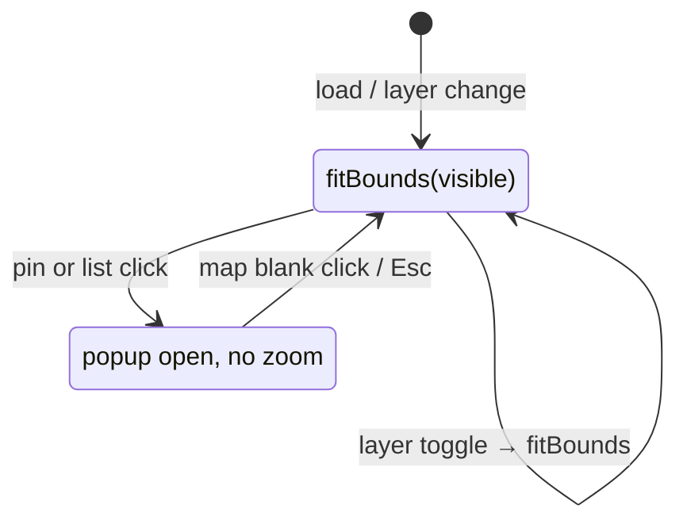

# 周辺エリアマップ UX Spec — `resort-ux-designer` (L1)

**Date:** 2026-06-14  
**Benchmark:** [BKK Design Week 2026 — Coffee Ground Zero](https://bkkdw26.greydientlab.com/) — *Organic Drop-off* インタラクティブマップ（Awwwards Honorable Mention, Greydient Lab）  
**Input:** `docs/mock-assets/AREA_MAP_BKKDW_AGENT_BRIEF.md`  
**現状:** `docs/mock-assets/_shared/area-map.js`, `area-map.css`, `area-map.html`, `data/maps/biei-area.json`  
**対象:** 美瑛 LP モックの **周辺 POI マップ**（Leaflet + OSM）  
**対象外:** 七戸 `/map` リフトマップ艦隊（`map-*`）、ルート `src/` 本番 UI

---

## 0. スコープ宣言

本ドキュメントは **スキー場周辺の飲食・温泉・拠点** を俯瞰する Leaflet マップの UX である。  
七戸本番のコース／リフト SVG マップとは **別プロダクト・別ゲート** とする。座標の根拠・手置き線の禁止は `lift-map-no-fake-overlays.mdc` の精神を継承するが、UI パターン（ポップアップ・fitBounds・統一ピン）は BKKDW ベンチマークに寄せる。

---

## 1. ベンチマーク分析（BKKDW Organic Drop-off）

Greydient Lab の Drop-off Map は、Bangkok 全市の回収ポイントを **一度に見渡せる地図** として設計されている。Awwwards でも「Interactive Drop-Off Map」が独立要素として評価されている。

### 1.1 観察された UX パターン

| 観点 | BKKDW の挙動 | 美瑛への転用メモ |
|------|----------------|------------------|
| **情報階層** | 地図がセクションの主役。テキスト・フィルタは地図の上下フレーム | 地図ステージ ≥65%（デスクトップ）。リストは補助 |
| **初期縮尺** | 都市全体俯瞰 — **全ピンが同時に見える** | `fitBounds(visiblePins)` を初期・レイヤ切替のデフォルト |
| **ピン** | 黒丸 + 中央アクセントドット。カテゴリ別イラストなし | 統一ドットピン（`--area-text` 円 + `--area-accent` ドット） |
| **選択** | ピンタップ → **地図キャンバス上** に黒カードポップアップ | Leaflet `Popup` / `L.popup` を主。サイドバー詳細はミラー |
| **ポップアップ** | 名前 / 種別 / 地区 / 電話 / **VIEW MAP →** | 同構造。`phone` / `website` / `district` は任意フィールド |
| **ズーム** | 選択しても都市俯瞰を維持。必要なら最小パンのみ | `flyTo` によるズームイン **廃止** |
| **フィルタ** | 地区タブ（All Districts） | 既存レイヤ（飲食 / 温泉 / 拠点）を維持。切替後も fitBounds |
| **モバイル** | 地図フル幅。ポップアップはピン直上 | embed は地図フル高 + FAB リスト |
| **タイル** | 低彩度・淡色ベース | Carto Positron / light_all（現行維持可） |

### 1.2 コピーしないもの

| BKKDW | 美瑛モックでの代替 |
|-------|-------------------|
| ネオンイエロー `#E2FC07` + 黒の強コントラスト | Alpine Clarity+ 既存トークン `--area-accent: #5a6f85`, `--area-text: #1a1f26` |
| ピクセルシャッフルアニメーション | `prefers-reduced-motion` 準拠の最小トランジションのみ |
| 地区タブ UI のビジュアルそのまま | レイヤーチップは LP 既存 `.map-layer-btn` を継承 |

### 1.3 ユーザー課題（現状ギャップ）

現行 `area-map.js`（Plan A: ski-centric `setView`）は、スキー場起点の trip planner として有効だったが、BKKDW 型の **「全ピン俯瞰 → タップで詳細」** とは以下で乖離する。

| 課題 | 現状 | BKKDW 型の期待 |
|------|------|----------------|
| 詳細の主役 | 右レール `.area-detail` | 地図上ポップアップ |
| 初期縮尺 | `centerAnchorId: ski` + 固定 zoom | `fitBounds` で表示中全ピン |
| 選択時 | `flyTo` + `selectionZoom` | 俯瞰維持 + 最小パン |
| ピン | カテゴリ別 PNG 32/48 | 統一ドット |
| レイアウト | 地図 : レール ≈ 50:50 | 地図 ≥70% : レール ≤30% |
| CTA | テキストリンク | 全幅ボタン **VIEW MAP →** |

---

## 2. 設計原則（3案共通）

1. **Map-first** — 開いた瞬間に「どこに何があるか」が一目でわかる（P0 = 全ピン俯瞰）。
2. **Popup-primary** — 詳細・CTA は地図上の小さなカード。リストは選択の代替経路。
3. **No zoom-on-select** — 選択はハイライト + ポップアップ。クリップ時のみ `panTo`。
4. **Unified pin** — 視覚ノイズを抑え、密度の高いクラスタでも読める。
5. **Layer = filter, not zoom trap** — レイヤ切替後は必ず `fitBounds` し直す。
6. **禁止** — リスト選択で地図を覆う全画面モーダル / bottom sheet（ポップアップ以外）。七戸 `/map` のリスト→sheet パターンは流用しない。

---

## 3. 三案

### 案 A — **BKKDW 忠実型**（Map-First Flat）

> Greydient の Drop-off Map を **構造ごと最小翻訳**。地図・ポップアップ・fitBounds の三要素だけで完結。

#### レイアウト

```
┌─────────────────────────────────────────────────────────────┐
│ topbar（スタンドアロンのみ）                                  │
├──────────────────────────────────────────┬──────────────────┤
│                                          │  filter chips    │
│                                          │  ─────────────   │
│         MAP STAGE (72%)                  │  01 じゅんぺい   │
│         fitBounds 俯瞰                    │  02 美瑛ファーム  │
│         淡色タイル + 2px accent frame     │  03 …           │
│         統一ドットピン                     │  （スクロール）    │
│              ┌──────────────┐            │                  │
│              │ popup 280px  │            │  ※ .area-detail  │
│              │ VIEW MAP → │            │     非表示        │
│              └──────────────┘            │                  │
├──────────────────────────────────────────┴──────────────────┤
│ disclaimer（スタンドアロンのみ）                              │
└─────────────────────────────────────────────────────────────┘
```

| ブレークポイント | 地図 | リスト | ポップアップ |
|------------------|------|--------|--------------|
| ≥1024px | 72%, `min(72vh, 720px)` | 右 28%, 番号リストのみ | ピン上 280px, `autoPan` |
| 768–1023px | 上 65% | 下 35% | 端で flip |
| ≤767px スタンドアロン | 上 60dvh | 下リスト | CTA 44px |
| ≤767px embed | 100% 高 | FAB → 下部シート（既存） | FAB 上 offset +44px |

#### インタラクション

- 初期 / レイヤ切替: `fitBounds(visible, padding [32,32], maxZoom: 14)`。
- ピン or リスト click → `bindPopup` open、`selectedId` 同期、ピン scale 1.25。
- 空白 click / Esc → popup close。
- **ズーム変更なし**（`autoPanPadding` のみ）。

#### 長所

- BKKDW との差分が最小。実装・評価が直線的。
- ピン密度が高い美瑛町内クラスタで最も読みやすい。

#### 短所

- 飲食+温泉同時 ON で fitBounds が広域になり、町内ピンが小さくなる（BKKDW も同様のトレードオフ）。
- スキー場「起点」ナラティブはポップアップ／リスト順序で補う必要あり。

---

### 案 B — **Alpine Clarity 調停型**（Map-Primary + Slim Rail）

> 案 A の地図主役を維持しつつ、**スキー場 LP の回遊導線**（特集記事・レイヤーチップ）を右レールに薄く残す。BKKDW + 美瑛既存モックのハイブリッド。

#### レイアウト

```
┌─────────────────────────────────────────────────────────────┐
│ topbar + layer filter（スタンドアロンはレール頭に集約）        │
├──────────────────────────────────────────┬──────────────────┤
│                                          │  eyebrow: HUB    │
│         MAP STAGE (70%)                  │  ● 町民スキー場   │
│         fitBounds 俯瞰                    │  ─────────────   │
│         popup = 主詳細                    │  numbered list   │
│                                          │  ─────────────   │
│                                          │  「特集を読む」   │
│                                          │  ghost link only │
│                                          │  (.area-detail   │
│                                          │   は廃止)        │
└──────────────────────────────────────────┴──────────────────┘
```

#### 案 A との差分

| 項目 | 案 A | 案 B |
|------|------|------|
| レール幅 | 28% | 30%（地図 70%） |
| レール内容 | リストのみ | リスト + `readGuide` リンク（food/onsen のみ） |
| スキー場の見せ方 | リスト先頭 | リスト先頭 + ドット 1.5× + popup に「拠点」バッジ |
| embed レイヤー | 親 LP チップ | 同左（変更なし） |
| ポップアップ | 同一 | 同一 + 特集リンクを popup 内 secondary CTA |

#### 長所

- LP 回遊（nearby-food / nearby-onsen 特集）を失わない。
- Director の V5（ブランド一貫）と V6（LAAX 的 editorial）に有利。

#### 短所

- レールに CTA が残ると「ポップアップが主」の原則が薄れる。実装時は **popup CTA を Primary、特集を Ghost** と明確化が必要。

---

### 案 C — **クラスター俯瞰型**（Cluster fitBounds + Ring Dot）

> 美瑛の地理的 **二クラスター**（町内＝飲食+スキー / 白金＝温泉）を前提に、レイヤーごとに fitBounds 対象を切り替える。ピンは統一ドットだが **2px リング色** で food / onsen / anchor を区別。

#### レイアウト

- 案 A と同じ 72/28（地図主役）。
- ピン: 黒円 + 中央ドット + リング色（food `#5a6f85`, onsen `#7ec8e3`, anchor `#2f8f8f`）。

#### 縮尺ポリシー（boundsProfiles 継承 + BKKDW fitBounds）

| レイヤー組合せ | fitBounds 対象 | maxZoom |
|----------------|----------------|---------|
| food + anchor | 町内 food + ski + 駅（遠方 food 除外） | 14 |
| onsen | 白金温泉 10 件 | 13 |
| onsen + anchor | 白金 + 駅（ski 除外） | 12 |
| food + onsen + anchor | 町内 + 白金（**二極** — 広域俯瞰） | 10 |
| anchor only | ski + 駅 + 青い池 | 11 |

#### 長所

- 現行 `biei-area.json` の `boundsProfiles` と整合。温泉のみ／飲食のみで **常に適切な俯瞰**。
- リング色でカテゴリ PNG なしでもレイヤー識別可能。

#### 短所

- 案 A より実装・データ契約が重い（profile × popup × ring）。
- food+onsen 同時は本質的に広域 — BKKDW の「全市俯瞰」に近いが、町内ピンが小さくなる問題は残る。

---

## 4. 比較表

| 評価軸 | 案 A BKKDW 忠実 | 案 B Alpine 調停 | 案 C クラスター俯瞰 |
|--------|----------------|------------------|---------------------|
| **BKKDW 忠実度** | ◎ | ○ | ○ |
| **全ピン俯瞰（初期）** | ◎ fitBounds 一律 | ◎ 同左 | ◎ レイヤー別 fitBounds |
| **地図画面比（desktop）** | 72% | 70% | 72% |
| **ポップアップ主役** | ◎ | ○（レールに特集残） | ◎ |
| **統一ドットピン** | ◎ | ◎ | ○（+リング色） |
| **スキー場起点ナラティブ** | △ | ◎ | ○ |
| **LP 回遊（特集導線）** | △ popup のみ | ◎ | ○ |
| **food+onsen 同時** | △ ピン小 | △ | ○ profile で制御 |
| **実装コスト** | 低 | 中 | 中〜高 |
| **L3 評価リスク** | 低 | 中（CTA 二重） | 中（リング = カテゴリ色復帰？） |
| **七戸 /map 混同リスク** | 低 | 低 | 低 |

**凡例:** ◎ 優位 · ○ 可 · △ 注意

---

## 5. 共通コンポーネント spec（Director / handoff へ）

### 5.1 統一ドットピン

```
外円: 20px（active 24px）— fill var(--area-text) #1a1f26
内ドット: 6px（active 8px）— fill var(--area-accent) #5a6f85
案 C のみ: 外円 2px stroke（food/onsen/anchor 色）
shadow: 0 1px 3px rgba(26,31,38,.25)
実装: L.divIcon（PNG 廃止。marker-poi-dot は SVG 1 枚でも可）
```

- スキー場（`id: ski`）: 外円 24px / 内ドット 8px（**サイズのみ**差別。イラスト PNG に戻さない）。

### 5.2 地図上ポップアップ

```html
<div class="area-map-popup" role="dialog" aria-labelledby="area-popup-title-{id}">
  <button type="button" class="area-map-popup__close" aria-label="閉じる">×</button>
  <h3 id="area-popup-title-{id}">{label}</h3>
  <p class="area-map-popup__category">{category i18n}</p>
  <!-- district / phone / website: 存在時のみ -->
  <a class="area-map-popup__cta" href="{googleMapsUrl}">Google マップで開く →</a>
  <!-- 案 B のみ: -->
  <a class="area-map-popup__guide area-link-ghost" href="{guideHref}">特集を読む</a>
</div>
```

| トークン | 値 |
|----------|-----|
| 幅 | `min(280px, calc(100vw - 48px))` |
| 背景 | `#ffffff` |
| 枠 | `1.5px solid #1a1f26` |
| 文字 | `#1a1f26` |
| 補助文字 | `#5c6570` |
| CTA 高 | `min-height: 36px`（padding で 44px タップ可） |
| CTA | 背景 `#1a1f26` / 文字 `#ffffff` |
| Secondary | 白地・黒枠・黒文字 |
| 角丸 | `0`（BKKDW 型・角張り） |

### 5.3 状態遷移（3案共通）



### 5.4 レスポンシブ比率（確定値）

| モード | 地図 | レール / リスト |
|--------|------|-----------------|
| Desktop ≥1024 | **72%** 幅, `min-height: min(72vh, 720px)` | **28%** |
| Tablet 768–1023 | **65%** 高 | **35%** |
| Mobile standalone | **60dvh** | 残り |
| Mobile embed | **100%** iframe 高 | FAB + 下部シート |

### 5.5 地図フレーム（BKKDW 構造参考）

- `border: 2px solid var(--area-accent)` + `border-radius: 0.5rem`
- タイル: Carto `light_all` または Positron（**標準 OSM カラーは不可**）
- embed: フレームは親 `.map-embed` の `border-radius` に委譲

---

## 6. UX 推奨（Director への示唆）

**第一推奨: 案 B（Alpine Clarity 調停型）**

| 理由 |
|------|
| BKKDW の **地図主役・ポップアップ・fitBounds・統一ピン** を満たす |
| 美瑛 LP 既存の **特集回遊・スキー場起点** をレール／popup secondary で維持 |
| 案 C のクラスター制御は `boundsProfiles` として **案 B に内包可能**（リング色は v2 では省略し、純粋ドットで開始してもよい） |

**次点: 案 A** — 実装速度最優先・BKKDW 検証用。  
**保留: 案 C** — food+onsen 同時利用が多い場合の Phase 2。

---

## 7. 禁止パターン（3案共通）

1. 選択時の `flyTo` / `setView` によるズームイン（`maxZoom` を超える拡大）。
2. リスト選択で地図全体を覆う sheet / modal（embed FAB シートは **リスト専用**、詳細は popup）。
3. カテゴリ別 PNG ピンへの回帰（v2）。
4. 根拠なき POI 座標追加。
5. 七戸 `/map` の SVG コース線オーバーレイの流用。
6. BKKDW ネオンイエローのそのまま採用。

---

## 8. 次エージェント

| 順 | エージェント | 入力 | 成果物 |
|----|-------------|------|--------|
| 2 | `resort-design-director` | 本 spec + `AREA_MAP_BKKDW_AGENT_BRIEF.md` | `area_map_requirements.md`（1案確定 + V1–V5） |
| 3 | `resort-i18n-spec` | requirements | `area_map_i18n.md` |
| 3 | `resort-map-bridge` | brief §2 | `area_map_data_contract.md` |
| 4 | `resort-spec-handoff` | 上記 3 件 | `area_map_handoff_checklist.md` |
| 5 | `resort-template-implementer` | handoff | `area-map.js` 他 L2 |

---

## 9. 参考

- [BKKDW 2026 — Coffee Ground Zero](https://bkkdw26.greydientlab.com/)
- [Greydient Lab — プロジェクト概要](https://www.greydientlab.com/works/bkkdw2026-coffee-ground-zero)
- [Awwwards — Coffee Ground Zero](https://www.awwwards.com/sites/coffee-ground-zero-bkkdw2026)
- 入力指示書: `docs/mock-assets/AREA_MAP_BKKDW_AGENT_BRIEF.md`
