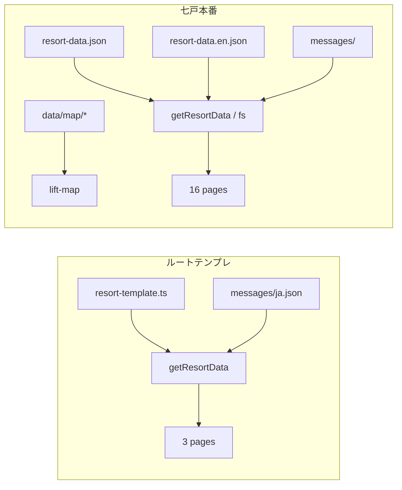

# テンプレート差分棚卸し — 七戸 vs ルート `src/`

> **目的**: 七戸を「第1号完成形」として仕上げたあと、**テンプレとして機能する部分 / しない部分** を明確にし、2本目以降の生成方針を決める。  
> **作成**: 2026-06-12  
> **対象**: `src/`（ルート汎用テンプレ） vs `resorts/Sichinohe-CyoueiSki/web/`（七戸本番）

---

## 方針（合意）

1. **先に七戸を完成** — evaluator PASS・本番デプロイ安定・コンテンツ実データ
2. **完成後に本書を更新** — 「還流済み」「テンプレ化対象」「七戸固有」のラベルを確定
3. **その後** `resort.manifest.json` / `create-resort` CLI — 本書の CONFIG 層を機械化

---

## 七戸の状態 — 2 段階で見る（重要）

| 段階 | 意味 | 現状 |
|------|------|------|
| **A. 技術ゲート** | 特定ページの a11y / visual / マップ interaction PASS | 一部ページは PASS |
| **B. 体験としての完成** | 本番を見た利用者が「空」「未実装」と感じない | **❌ 未達**（2026-06-12 ユーザー指摘） |

> **教訓**: evaluator PASS ≠ サイト完成。ホーム下段・`/plan/*` の **コンテンツ実体** を別ゲートにする。

---

## B. 体験完成 — 本番で目に見えるギャップ（優先）

スクリーンショット（`AudienceDuet` 付近）で確認された問題。

| 箇所 | 症状 | 根拠 |
|------|------|------|
| **`AudienceDuet`** | モノクロ雪面プレースホルダ + 英語見出し（Powder / Family / EXPLORE） | `AudienceDuet.tsx` → `hero-groomed-monochrome.png`（64KB 仮画像） |
| **`/plan/transit-powder`** | EXPLORE の行き先。本文 1 段落のみ | `messages/ja.json` `lead`: 「**準備版ページです**…」 |
| **`/plan/beginners-hidden-gem`** | BEGINNERS GUIDE の行き先。同上 | 同上 |
| **`/plan/transit-shinkansen`** | GuidesReveal から同様 | 同上 |
| **ホーム i18n** | ~~英語混在~~ → **2026-06-12 修正**（`messages/ja.json` / `en.json` の `home.*`） | 要デプロイで本番反映 |
| **ライブカメラ** | サムネも `hero-groomed-monochrome.png`、status `preparing` | `resort-data.json` `liveCams` |

### ホーム LP セクション別（体験完成度）

| セクション | 体験 | 技術 evaluator |
|------------|------|----------------|
| `CinematicHero` | ○ 実データ + 本番ヒーロー | PASS |
| `AsymmetricTransit` | △ コピーはあるが `hero-train.png` は汎用素材 | 未評価 |
| `ImmersiveLiveCam` | △ プレースホルダー映像 | 未評価 |
| `PathMagnet` | ○ 主要導線は実ページへ | PASS |
| **`LpHighlightDuet`** | **△ 2026-06-12 実装** — `lpHighlights.featured` で駅近+蔦温泉、`/access`・`/stay-local` へ | 要デプロイ |
| `NewsTeaser` | △ データ依存 | 未評価 |
| **`GuidesReveal`** | **✗ 展開先 plan が準備版のみ** | **要対応** |

### LP 売り2点選択（テンプレ化 — 2026-06-12 実装）

```
data/resort-data.json
  lpHighlights.catalog[]   ← リサーチ候補プール（source フィールドに根拠メモ）
  lpHighlights.featured[]  ← ホームに載せる ID を2件指定（順序どおり）

messages/{locale}.json
  home.lpHighlights.items.{id}  ← タイトル・本文・CTA（ja/en）

LpHighlightDuet.tsx  ← catalog + featured を合成表示
```

**七戸の featured**: `transit-station`（駅チカ）+ `tsuta-onsen`（蔦温泉）  
**プールに残す候補**: `powder-upper`, `family-gentle`（featured を差し替えるだけでローテ可）

**テンプレ教訓**: 売りは **リサーチプール → featured 2件 → 実ページへリンク**。`/plan/*` 準備版へ飛ばさない。

---

## A. 技術ゲート（ページ単位 — 体験完成とは別）

| 項目 | 状態 | 備考 |
|------|------|------|
| a11y 全站 | ✅ PASS | [`docs/qa_report.md`](../../../docs/qa_report.md) 2026-06-10 |
| マップ interaction G6 | ✅ PASS | [`docs/qa_report_map.md`](../../../docs/qa_report_map.md) |
| `/access` visual | ✅ PASS | AccessMapSigns 再評価 2026-06-11 |
| `/tickets-rental` visual | ✅ PASS | [`qa_report_visual_tickets_rental.md`](./qa_report_visual_tickets_rental.md) |
| CinematicHero visual | ✅ PASS | [`docs/qa_report_visual.md`](../../../docs/qa_report_visual.md) |
| `/today` visual | ✅ PASS | 再評価 2026-06-12 — [`qa_report_visual_today.md`](./qa_report_visual_today.md) |
| ホーム PathMagnet visual | ✅ PASS | 再評価 2026-06-12 — [`qa_report_visual_home.md`](./qa_report_visual_home.md) |
| 本番デプロイ | ✅ | Actions 経路は動作 |
| ヒーロー画像 | ✅ 現行で可 | 関係者差し替えは Phase 2 — [`home-hero-spec.md`](./home-hero-spec.md) §6 |
| **ホーム AudienceDuet / GuidesReveal** | **未** | **体験ギャップ — 完成扱い不可** |
| **`/plan/*` 3 ページ** | **準備版** | `lead` に「準備版ページです」と明記 |

### Phase 2 / テンプレ還流後

- **ヒーロー差し替え** — スキー場関係者提供写真（`hero-sichinohe.png` 上書き + §5.3 再監査）
- `notice-banner` hex → トークン化
- `award-table` の `overflow-x: auto`
- ホーム `AsymmetricTransit` 等の eyebrow 完全統一
- Vercel Connect Git
- Google/Mapbox キー本番設定（`accessMapTier` 向上）
- `trails.geojson` コース4整備（マップデータ品質・本番ブロック外）

---

## 3層モデル（テンプレ化の見方）

| 層 | 意味 | 新規リゾートでの扱い |
|----|------|----------------------|
| **A. テンプレ（コード）** | リゾート名を差し替えてもそのまま使える UI・ロジック | 共有 `web/` または npm パッケージ化 |
| **B. 設定（データ）** | `slug`・料金・座標・文言・画像パス | `resort.manifest.json` + `messages/` + `public/images/` |
| **C. リゾート固有（七戸のみ）** | 座標・提携・affiliate・マップ資産・運用履歴 | `resorts/Sichinohe-CyoueiSki/` 配下に閉じる |

**ルール**: B に寄せられるものは C に留めない。C はマップ幾何・現地写真・契約リンクに限定する。

---

## 規模感

|  | ルート `src/` | 七戸 `web/src/` |
|--|---------------|-----------------|
| ファイル数 | 32 | 108 |
| ページ (`page.tsx`) | 3（`/`, `/map`, `/courses`） | 16 + `/admin` |
| 依存 | framer-motion のみ | + mapbox-gl, @googlemaps/js-api-loader, @vercel/blob |
| データ | `src/data/resort-template.ts` + `messages/` | `data/resort-data.json` + `data/map/*` + `messages/` |

七戸はルートテンプレの **約3.4倍** の実装量。単純 fork では横展開が重い。

---

## A. テンプレとして機能する（還流候補）

七戸で実装済み・他リゾートでも **コード変更なし**（B のみ差し替え）で使える想定のもの。

### デザインシステム

| パス（七戸） | ルート相当 | 還流 |
|--------------|------------|------|
| `styles/award-design-system.css` | なし（`globals.css` のみ） | **新規テンプレの基盤** |
| `components/AwardPageShell.tsx` | `sections/*` + `layout/*` 分散 | 還流 |
| `components/AwardFold.tsx` | なし | 還流（FAQ 等） |
| `components/AwardContentSection.tsx` | なし | 還流 |
| `components/AwardButton.tsx` | `ui/Button.tsx` | 置換候補 |
| `components/SectionHeader.tsx` | `ui/SectionHeading.tsx` | 置換候補 |

### レイアウト・ナビ

| 七戸 | ルート | 備考 |
|------|--------|------|
| `SiteHeader.tsx`, `SiteFooter.tsx`, `MobileBottomNav` 相当 | `components/layout/*` | IA は七戸が拡張（16リンク） |
| `i18n/*`, `middleware.ts` | 同一パターン | **テンプレ** |
| `LangSwitcher.tsx` | 同一 | **テンプレ** |
| `SkiResortJsonLd.tsx` | なし | 還流（B で name/coordinates） |

### ページシェル（パターン）

| ページ | コンポーネント | データ源 |
|--------|----------------|----------|
| `/today` | `AwardPageShell` + snapshot grid | `data.today.*` |
| `/tickets-rental` | `AwardPageShell` + `AwardContentSection` + tables | messages + JSON |
| `/faq`, `/news`, `/contact` | `AwardPageShell` + 各 UI | messages + JSON |
| `/lessons-events`, `/stay-local`, `/lift-deals` | 同上 | messages + JSON |
| `/live-cams` | `LiveCamGrid` / `LiveCamFrame` | `liveCams` in JSON |
| `/plan/*` | `AwardPageShell` + 記事型 | messages |

### アクセス（汎用化度高）

| コンポーネント | テンプレ化 |
|----------------|------------|
| `AccessMapHeroShell.tsx` | ◎ 地図 tier fallback 共通 |
| `AccessMapBackground.tsx` | ◎ Google → Mapbox → OSM |
| `AccessMapSigns.tsx` | ◎ Web Mercator + landmarks[] |
| `AccessMapActions.tsx` | ◎ navigate URL 生成 |
| `AccessTaxiBlock.tsx` | ○ 構造は共通、会社名は B |
| `access-deep-links.ts` | ◎ URL ビルダー |

### ホーム LP（七戸版 = テンプレの「フルセット」）

| セクション | ルート相当 | 差分 |
|------------|------------|------|
| `CinematicHero` | `HeroSection` + `LiveStatusStrip` | 別デザイン言語（award） |
| `PathMagnet` | `BentoExploreGrid` + `PrimaryCtaBand` | 4タイル導線 |
| `AsymmetricTransit`, `AudienceDuet`, `GuidesReveal`, `NewsTeaser`, `ImmersiveLiveCam` | 一部のみ（Bento, News） | 七戸拡張 |

ルートの **Alpine Clarity**（`HeroSection`, `BentoExploreGrid`, `framer-motion`）と七戸の **Alpine Clarity+ / Award** は **並行系統**。テンプレ還流時は **七戸系を正** とするか、ルートを deprecated にするかを決める必要あり。

### API（テンプレ）

| ルート | 用途 |
|--------|------|
| `/api/public/build-info` | デプロイ確認 |
| `/api/public/resort` | 正規化リゾート JSON |
| `/api/public/resort/popup` | ハブ用ポップアップ |
| `/api/public/map-status` (+ stream) | リフト・コース状態 |
| `/api/admin/*` | スタッフ更新（token 保護） |

### マップ UI（コードはテンプレ、資産は C）

| パス | テンプレ |
|------|----------|
| `components/lift-map/*`（Viewer, Rail, Hitboxes, Mapbox3D 等） | ◎ 全リゾート共通 UI |
| `lib/map-data.ts`, `map-focus.ts`, `map-i18n.ts` | ◎ |
| `data/map/hitboxes-*.json`, `hero-*.png`, `trails.geojson` | **C**（リゾートごと） |

### エージェント・パイプライン

| 資産 | テンプレ |
|------|----------|
| ルート `resort-*` 艦隊 | 全リゾート共通 L1–L3 |
| `resorts/Sichinohe-CyoueiSki/.cursor/agents/` map-* | 七戸実装を雛形にコピー |
| `scripts/run-map-pipeline.mjs` 等 | テンプレ CLI に組込み候補 |

---

## B. 設定として差し替える（テンプレの入力）

### ルート現行モデル

```
src/data/resort-template.ts   ← ResortConfig（数値・URL・id）
messages/{locale}.json        ← 文言（getResortData が合成）
src/types/resort.ts
```

### 七戸現行モデル

```
data/resort-data.json         ← 単一の大 JSON（ja 本文混在）
data/resort-data.en.json      ← 英語オーバーレイ
messages/{locale}.json        ← UI ラベル・ページコピー
```

**ギャップ**: 七戸の `ResortData` 型（`lib/resort-data.ts`）はルートの `ResortConfig` より **5倍以上フィールド**（access landmarks, taxi, affiliate, liveCams, faq, today snapshot…）。

**テンプレ化の核**: 七戸完成後に `resort.manifest.json` スキーマを **七戸 JSON から逆生成**し、ルート `ResortConfig` は deprecated または manifest のサブセットに。

### B に属するファイル一覧

| 種別 | 七戸パス |
|------|----------|
| コアデータ | `data/resort-data.json`, `data/resort-data.en.json` |
| 文言 | `messages/ja.json`, `messages/en.json` |
| 画像 | `public/images/hero-sichinohe.png`（**差し替え可**・パス固定）, favicon, OGP |
| テーマ | `globals.css` の CSS 変数（色・フォント）— 将来 manifest `theme` |
| 環境変数 | `NEXT_PUBLIC_*`, `ADMIN_UPDATE_TOKEN`, Map API keys |
| Vercel | プロジェクト ID、Root Directory |

---

## C. テンプレとして機能しない（七戸固有・要手作業）

### マップ資産（ルール上、自動生成だけでは不足）

| 資産 | 理由 |
|------|------|
| `public/maps/sichinohe-hero-v5.png` | イラスト焼き込み・layout-v5 固有 |
| `data/map/hitboxes-hero-v5.json` | 手トレース・QA 必須 |
| `data/map/lifts.geojson`, `trails.geojson` | source フィールド・現地/skimap 根拠 |
| `data/map/camera.json`, `control-points-*.json` | キャリブレーション履歴 |
| `data/map/resort-brief-shichinohe.json` | 七戸プロンプト brief |
| `scripts/build-*`, `trace-hitboxes` | パイプラインは共通化可、**出力は C** |

### 七戸ビジネス・提携

| 項目 | 例 |
|------|-----|
| アフィリエイト | Skyticket レンタカー、ValueCommerce pixel |
| タクシー会社 | 七戸町の事業者名・電話 |
| 駅・ランドマーク座標 | 七戸十和田駅、ゲレンデ入口 |
| `plan/*` 記事コピー | 「隠れた名所」等の編集コンテンツ |

### 運用・監査

| パス | 内容 |
|------|------|
| `data/map/status-audit.jsonl` | 更新履歴 |
| `docs/qa_report_visual_*.md` | 七戸 evaluator 記録 |
| `docs/map-interaction-spec-g*.md` | 七戸マップ仕様の進化 |

### ルートテンプレにあって七戸にないもの

| ルート | 状態 |
|--------|------|
| `framer-motion` / `use-scroll-reveal` | 七戸は CSS `award-rise` 中心 |
| `src/app/[locale]/map` = iframe `map-preview.html` | 七戸は React `LiftMapViewer` |
| 単一ページ LP（全セクションが `/`） | 七戸はマルチページ IA |
| Unsplash Bento 画像 | 七戸は実写/自前ヒーロー |

---

## ページ対応表

| ルート | ルート `src/` | 七戸 `web/` | テンプレ層 |
|--------|---------------|-------------|------------|
| `/` | 1ページ LP（7セクション） | CinematicHero LP（7セクション） | A（別実装） |
| `/today` | （LP内 LiveStatus のみ） | 専用ページ | A |
| `/access` | LP 内 `AccessSection` | 地図ファースト専用ページ | A（七戸版が正） |
| `/map` | iframe 静的 preview | フル React マップ | A + C 資産 |
| `/courses` | 簡易 | → `/map` redirect | A |
| `/tickets-rental` | LP 内 `TicketPricing` | 専用ページ | A |
| `/news` | LP 内 `NewsSection` | 専用ページ | A |
| `/faq`, `/contact`, `/lessons-events`, … | なし | あり | A |
| `/plan/*` | なし | 3ページ | A（コンテンツは B） |
| `/live-cams` | なし | あり | A |
| `/admin` | なし | あり | A |

---

## データフロー比較



---

## 七戸完成後の還流手順（案）

1. **visual 再評価** — `/today`, ホーム PathMagnet（修正済みコードに対し evaluator 再実行）
2. **本書の「還流済み」列を更新**
3. **共有パッケージ決定** — `packages/resort-web/` または `resorts/_template/web/` に七戸 `web/src` をベース化
4. **七戸を data のみに縮退**（長期）— `resorts/Sichinohe-CyoueiSki/data/` + 薄い `web/` ラッパー
5. **ルート `src/` の扱い** — deprecated ドキュメント or Alpine Clarity 簡易デモ専用に格下げ
6. **`create-resort` CLI** — B 層の scaffold のみ（C のマップは `--map=none|osm|illustrated`）

---

## サマリー一行

| | 内容 |
|--|------|
| **テンプレとして機能する** | Award デザインシステム、16ページ IA、access 地図スタック、lift-map React UI、admin/public API、i18n、エージェント艦隊 |
| **設定で差し替え** | `resort-data.json` + messages + テーマ + 画像 + env |
| **テンプレにならない** | マップ幾何・イラスト・ヒットボックス、提携リンク、編集記事、運用監査ログ |

**現在地**: 七戸は **技術ゲートは一部 PASS だが体験として未完成**。次は **ホーム下段（AudienceDuet / plan）の実体化 or 非表示** → その後テンプレ還流。
